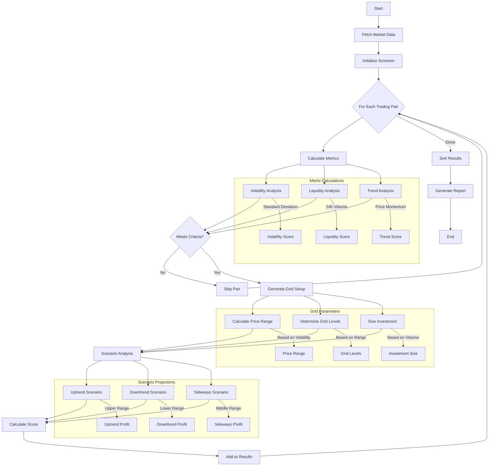

A **Grid Trading Pair Screener** is a tool that helps traders identify the best trading pairs for **grid trading** based on predefined criteria like **volatility, liquidity, and trend patterns**. It continuously monitors market conditions and suggests the optimal grid parameters for automated trading.

This project is a Agent Skill written as a Mech Tool (https://docs.olas.network/mech-tool/)

Grid trading is a popular automated trading strategy that profits from market fluctuations by placing buy and sell orders at predefined price levels. However, selecting the right trading pairs and optimizing grid settings are crucial for maximizing returns.

This project aims to automate pair selection, recommend ideal grid setups, and provide market scenario analysis to help traders make informed decisions. Whether the market is trending up, down, or moving sideways, the screener will outline potential outcomes and suggest configurations to optimize profits while managing risk.

## **How It Works**

1. **Data Collection**

   - Fetches real-time trading data from Dune Analytics
   - Analyzes price history, volume, and market metrics

2. **Pair Analysis**

   - Calculates volatility using standard deviation of returns
   - Assesses liquidity through 24-hour trading volume
   - Measures trend strength using price momentum

3. **Grid Setup**

   - Determines optimal grid ranges based on volatility
   - Suggests investment size based on liquidity
   - Calculates potential profit scenarios

4. **Screening Process**
   - Filters pairs based on minimum criteria
   - Ranks pairs by composite score
   - Generates detailed recommendations

### **Why Use It?**

- **Automates Pair Selection** → No need to manually check charts.
- **Optimized Grid Settings** → Maximizes efficiency and profitability.
- **Real-time Adjustments** → Adapts to changing market conditions.

### Output


## Screening Flowchart



## Screening Process Details

1. **Data Collection** (B)

   - Connect to Dune Analytics
   - Fetch 30-day trading history
   - Process raw market data

2. **Metric Calculation** (E)

   - **Volatility Analysis** (E1)

     - Calculate price returns
     - Compute standard deviation
     - Annualize volatility

   - **Liquidity Analysis** (E2)

     - Measure 24h trading volume
     - Assess market depth
     - Calculate average trade size

   - **Trend Analysis** (E3)
     - Compute price momentum
     - Analyze moving averages
     - Determine trend strength

3. **Screening Criteria** (F)

   ```python
   if (volatility >= params.volatility_threshold and
       liquidity >= params.liquidity_threshold and
       trend_strength >= params.trend_strength_threshold):
       # Pair qualifies
   ```

4. **Grid Setup Generation** (H)

   - **Price Range** (H1)

     ```python
     range_percentage = min(volatility * 2, params.max_price_range)
     upper_price = current_price * (1 + range_percentage)
     lower_price = current_price * (1 - range_percentage)
     ```

   - **Grid Levels** (H2)

     ```python
     grid_size = max(
         params.grid_levels,
         int((upper_price - lower_price) / (price * 0.01))
     )
     ```

   - **Investment Sizing** (H3)
     ```python
     suggested_investment = liquidity * params.investment_multiplier
     ```

5. **Scenario Analysis** (I)

   - **Uptrend** (I1)

     - Calculate potential profit from current to upper range
     - Estimate number of grid trades

   - **Downtrend** (I2)

     - Calculate potential profit from current to lower range
     - Estimate number of grid trades

   - **Sideways** (I3)
     - Calculate potential profit from range oscillation
     - Estimate number of grid trades

6. **Scoring System** (J)

   ```python
   score = (
       (volatility / params.volatility_threshold) * 0.4 +
       (liquidity / params.liquidity_threshold) * 0.4 +
       (trend_strength / params.trend_strength_threshold) * 0.2
   )
   ```

7. **Results Processing** (L, M)
   - Sort pairs by score
   - Generate detailed recommendations
   - Format output report

## **Dune Query**

The screener uses the following Dune query to fetch market data:

```WITH recent_trades AS (
    SELECT
        token_bought_symbol as token_symbol,
        block_time,
        amount_usd,
        token_bought_amount
    FROM dex.trades
    WHERE block_time >= NOW() - interval '30' day
    AND token_bought_symbol IN ('WBTC', 'ETH', 'WMATIC', 'AVAX', 'SOL')
    AND amount_usd > 0
    AND token_bought_amount > 0
),
price_data AS (
    SELECT
        token_symbol,
        block_time,
        amount_usd / token_bought_amount as price,
        amount_usd as volume
    FROM recent_trades
    WHERE token_bought_amount > 0
),
hourly_data AS (
    SELECT
        token_symbol,
        date_trunc('hour', block_time) as hour,
        AVG(price) as price,
        SUM(volume) as volume
    FROM price_data
    GROUP BY 1, 2
),
daily_volume AS (
    SELECT
        token_symbol,
        SUM(volume) as volume_24h
    FROM price_data
    WHERE block_time >= NOW() - interval '1' day
    GROUP BY 1
),
latest_prices AS (
    SELECT
        token_symbol,
        FIRST_VALUE(price) OVER (PARTITION BY token_symbol ORDER BY hour DESC) as current_price
    FROM hourly_data
),
price_history AS (
    SELECT
        h.token_symbol,
        ARRAY_AGG(CAST(h.price AS VARCHAR) ORDER BY h.hour DESC) as prices,
        ARRAY_AGG(CAST(h.hour AS VARCHAR) ORDER BY h.hour DESC) as timestamps
    FROM hourly_data h
    GROUP BY h.token_symbol
)
SELECT
    CONCAT(h.token_symbol, '/USDT') as pair_name,
    lp.current_price,
    COALESCE(d.volume_24h, 0) as volume_24h,
    ph.prices as price_history_values,
    ph.timestamps as price_history_times
FROM hourly_data h
LEFT JOIN daily_volume d ON h.token_symbol = d.token_symbol
LEFT JOIN price_history ph ON h.token_symbol = ph.token_symbol
LEFT JOIN latest_prices lp ON h.token_symbol = lp.token_symbol
GROUP BY
    h.token_symbol,
    lp.current_price,
    d.volume_24h,
    ph.prices,
    ph.timestamps
HAVING COUNT(*) >= 24
ORDER BY COALESCE(d.volume_24h, 0) DESC
LIMIT 10;

```

## **Contributing**

Feel free to submit issues and enhancement requests!

## **License**

MIT License - feel free to use this code for your own projects.
